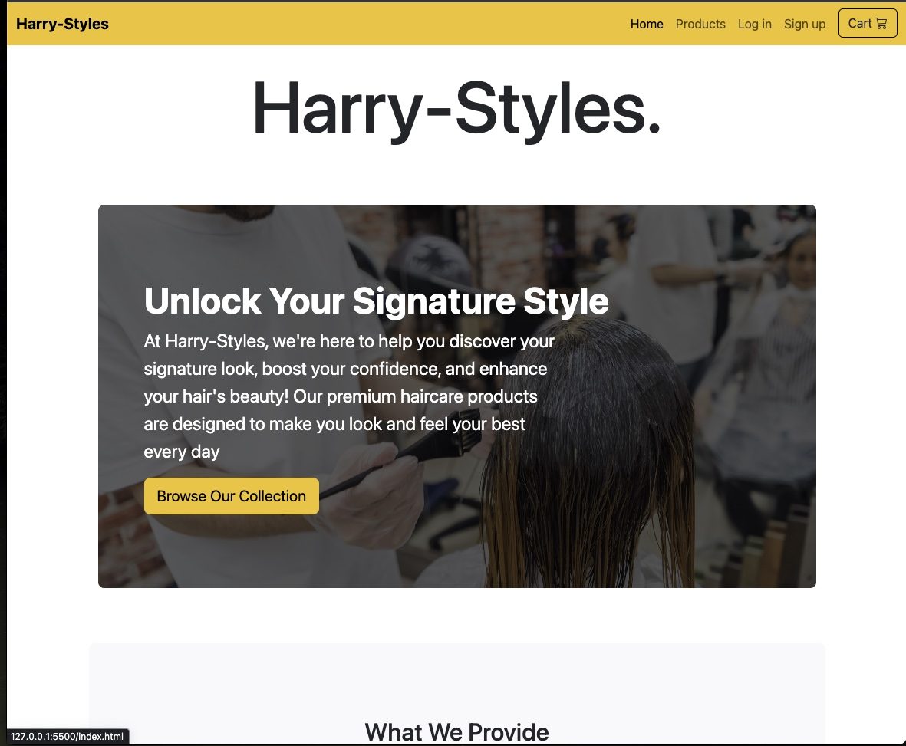

# Capstone 1: E-commerce 
# Harry-Styles Hair Product E-Commerce Website

Welcome to the Harry-Styles Hair Product E-Commerce Website project repository. This repository contains the source code and assets for our online store dedicated to premium haircare products.

## Description

Harry-Styles is an e-commerce website that specializes in selling quality hair products designed to help you discover your signature look, boost your confidence, and enhance your hair's beauty! Our premium haircare products are expertly crafted to make you look and feel your best every day.

It includes 5 pages being: Home, Products, Log in, Sign up, and Check out pages respectively. This project was built using HTML CSS and Bootstrap.

## Interesting Piece of Code
My favorite or most interesting piece of code from this project is actually pretty simple it is this line of code: 
. I choose this line because this is the div that wraps around each card for the products page which makes the product cards responsive when changing viewports. The other reason I choose it was because it was the longest amount of time I spent on a specific piece of code and the fact that it was something so simple was funny to me.

## Screenshots of Pages

